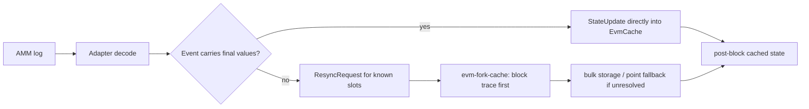

# evm-amm-state

`evm-amm-state` is a real-time AMM state engine built on a forked-EVM state
cache ([`evm-fork-cache`]). It tracks a working set of pools, **cold-starts**
their on-chain state into the cache, keeps them current **purely from chain log
events** (no RPC in the hot path), and runs fast, **fully-offline swap
simulations** against the live-synced state.

The defining design choice: **no reimplemented AMM math.** Every quote runs the
pool's *own* canonical on-chain quote entrypoint inside a local revm against the
warmed cache (e.g. Uniswap `QuoterV2`, Curve `get_dy`), then decodes the result.
There is no `LocalAMM`/`amm-math` formula layer to drift from the real contracts.

[`evm-fork-cache`]: https://github.com/KaiCode2/evm-fork-cache

## The pipeline

Each protocol is a single [`AmmAdapter`] implementation; the
[`AdapterRegistry`] dispatches by pool key.

| Stage | What it does |
| --- | --- |
| **Register** | Describe a pool: a [`PoolKey`] + [`ProtocolMetadata`] (tokens, fee, storage layout / coins, …). |
| **Cold-start** | `registry.cold_start(pool, cache, policy)` warms the pool's read-set into the [`EvmCache`] from forked storage. Named-slot protocols (Uniswap V2/V3, Solidly) warm known slots; layout-free protocols (Balancer, Curve) **discover → verify** the exact slots a quote call SLOADs. |
| **Subscribe** | `adapter.event_sources(pool)` lists the log topics to subscribe to over a `wss://` endpoint. |
| **React** | Decoded logs flow through [`AmmSyncEngine`] / [`AmmReactiveHandler`] + the `evm_fork_cache` reactive runtime. Exact-write protocols update cached state with **no RPC**; protocols whose logs do not carry final storage values emit hash-pinned resync requests that `evm-fork-cache` resolves from block traces, bulk storage, or point-read fallback. |
| **Simulate** | `adapter.simulate_swap(pool, cache, token_in, token_out, amount_in, &config)` executes the pool's own quote against the cached state and returns a [`SwapQuote`] — fully offline. |

[`AmmAdapter`]: src/adapters/traits.rs
[`AdapterRegistry`]: src/adapters/registry.rs
[`AmmSyncEngine`]: src/adapters/sync_manager.rs
[`AmmReactiveHandler`]: src/adapters/reactive.rs
[`PoolKey`]: src/adapters/types.rs
[`ProtocolMetadata`]: src/adapters/types.rs
[`EvmCache`]: https://github.com/KaiCode2/evm-fork-cache
[`SwapQuote`]: src/adapters/sim.rs

## Supported protocols

| Protocol | Feature | Quote entrypoint | Cold-start | Reactive |
| --- | --- | --- | --- | --- |
| Uniswap V2 | `uniswap-v2` | `Router02.getAmountsOut` | named slots | `Sync` → exact masked write |
| Uniswap V3 family (V3, PancakeSwap V3, Slipstream) | `uniswap-v3` (`pancake-v3`, `slipstream`) | `QuoterV2.quoteExactInputSingle` | slot0 + liquidity + multi-word tick scan (per-pool radius), or the one-shot full-range program sync (`v3_sync`) | `Swap` → slot0/liquidity; `Mint`/`Burn` → tick-range resync |
| Balancer V2 | `balancer-v2` | `Vault.queryBatchSwap` | discover → verify (`getPoolTokens`) | `Swap` → balance-slot resync |
| Solidly V2 (Aerodrome / Velodrome) | `solidly-v2` | pool `getAmountOut` | named slots (config layout) | `Sync` → two exact slot writes |
| **Curve** (StableSwap, StableSwap-NG, CryptoSwap v2, Tricrypto-NG) | `curve` | pool `get_dy` | discover → verify (`get_dy` read-set) | `TokenExchange` + liquidity events → slot resync |

All protocol features are on by default. See [`docs/curve-adapter.md`](docs/curve-adapter.md)
for the Curve adapter in depth.

### Extending with a new AMM

You can add a brand-new AMM from *outside* the crate — no fork, no `src/` edit —
via the `Custom` protocol id / pool key / metadata hatches and a minimal
[`AmmAdapter`] (only `protocol()` + `simulate_swap()`). See the runnable,
self-contained demo [`examples/custom_adapter.rs`](examples/custom_adapter.rs)
(`cargo run --example custom_adapter`) and the guide
[`docs/writing-an-adapter.md`](docs/writing-an-adapter.md).

The V3 cold-start tick-scan radius is per-pool configurable via
`V3Metadata.warm_word_radius` (default ±2 tick-bitmap words).

## Quickstart

Register a pool, cold-start it into a forked cache, and simulate a swap entirely
offline once warmed:

```rust,ignore
use std::sync::Arc;

use alloy_eips::{BlockId, BlockNumberOrTag};
use alloy_network::AnyNetwork;
use alloy_primitives::{U256, address};
use alloy_provider::{Provider, RootProvider};
use evm_fork_cache::cache::EvmCache;
use evm_amm_state::adapters::{
    AdapterRegistry, AmmAdapter, ColdStartPolicy, PoolKey, PoolRegistration,
    ProtocolMetadata, SimConfig, ConcentratedLiquidityAdapter, V3Metadata,
};
use evm_amm_state::adapters::storage::V3StorageLayout;

#[tokio::main]
async fn main() -> anyhow::Result<()> {
    let provider = Arc::new(RootProvider::<AnyNetwork>::connect("https://eth.llamarpc.com").await?);
    let block = provider.get_block_number().await?;
    let mut cache = EvmCache::at_block(provider, BlockId::Number(BlockNumberOrTag::Number(block))).await;

    let usdc = address!("A0b86991c6218b36c1d19D4a2e9Eb0cE3606eB48");
    let weth = address!("C02aaA39b223FE8D0A0e5C4F27eAD9083C756Cc2");
    let pool = address!("88e6A0c2dDD26FEEb64F039a2c41296FcB3f5640"); // USDC/WETH 0.05%

    let mut registry = AdapterRegistry::new();
    registry.register_adapter(Arc::new(ConcentratedLiquidityAdapter::default()))?;

    let mut reg = PoolRegistration::new(PoolKey::UniswapV3(pool))
        .with_state_address(pool)
        .with_metadata(ProtocolMetadata::UniswapV3(V3Metadata {
            token0: Some(usdc),
            token1: Some(weth),
            fee: Some(500),
            tick_spacing: Some(10),
            storage_layout: Some(V3StorageLayout::uniswap(10)),
        }));
    registry.cold_start(&mut reg, &mut cache, ColdStartPolicy::Eager)?;

    // Offline from here: no RPC needed to quote.
    let out = ConcentratedLiquidityAdapter::default().simulate_swap(
        &reg, &mut cache, usdc, weth, U256::from(1_000_000_u64), &SimConfig::default(),
    )?;
    println!("1 USDC -> {} WETH (raw)", out.amount_out);
    Ok(())
}
```

The full **cold-start → WebSocket subscribe → react → simulate** loop is in
[`examples/adapter_pipeline.rs`](examples/adapter_pipeline.rs):

```bash
ETH_WS_URL=wss://your-node cargo run --example adapter_pipeline
# or derive wss:// from an https endpoint:
E2E_RPC_URL=https://your-archive-node cargo run --example adapter_pipeline
```

Live sync should use [`AmmSyncEngine`] or, if wiring the upstream runtime
manually, `ReactiveRuntime::ingest_batch_with_resync`. Plain `ingest_batch`
decodes and applies direct writes only; it reports Balancer/Curve/V3 repair
requests without executing the trace/storage resync phase. The boundary and
fallback policy are documented in
[`docs/trace-backed-sync.md`](docs/trace-backed-sync.md).



### Arbitrage examples

Two end-to-end examples show the canonical use case — pricing swaps across many
pools offline to find and size a dislocation. Both warm real pools from an
archive node, then quote entirely offline:

```bash
# Cross-DEX: quote USDC/WETH across Uniswap V2, V3, and Curve; find the best
# buy + sell venue and price the round trip.
E2E_RPC_URL=<archive-url> cargo run --example arbitrage_cross_dex
# Triangular: walk USDC -> USDT (Curve 3pool) -> WETH (Curve tricrypto2)
# -> USDC (Uniswap V3) and price the cycle.
E2E_RPC_URL=<archive-url> cargo run --example arbitrage_triangular
```

See [`examples/arbitrage_cross_dex.rs`](examples/arbitrage_cross_dex.rs) and
[`examples/arbitrage_triangular.rs`](examples/arbitrage_triangular.rs).

### One-shot V3 full-pool sync

The [`v3_sync`](src/adapters/v3_sync.rs) module generates a ~360-byte EVM
program (tick spacing and storage layout baked in as immediates) that is
injected over a pool's code via an `eth_call` state override
([`evm-fork-cache`'s bulk-storage transport]) and walks the **entire** tick
bitmap *inside the EVM* — returning statics, every initialized tick's four
info words, and the whole observation ring in **one call with zero calldata**.
Live-measured on the USDC/WETH 0.05% pool: 1,563 ticks + 723 observations →
7,674 slots injected in ~140 ms for 26 CU (vs ~153k CU as point reads), after
which a hard multi-tick-crossing quote runs in **~5 ms with zero lazy
fetches** (vs ~2 s paging ticks over RPC on a windowed cache). A
calldata-driven **partial** variant refreshes selected bitmap-word ranges
(the planner-window shape, or dense spacing-1 pools in chunks).

```bash
E2E_RPC_URL=<https endpoint> cargo run --release --example v3_full_sync
# live parity suite (state, quote, and partial-window equivalence):
E2E_RPC_URL=<archive-url> cargo test --test v3_full_sync_rpc -- --ignored
```

[`evm-fork-cache`'s bulk-storage transport]: https://github.com/KaiCode2/evm-fork-cache/blob/main/docs/bulk-storage-extraction.md

### One-shot flat-slot sync

The [`storage_sync`](src/adapters/storage_sync.rs) module covers adapters whose
hot state is already known as a slot list:

- **Uniswap V2**: canonical `token0`, `token1`, and packed reserves slots.
- **Solidly V2**: config-supplied reserve/token slot layout.
- **Balancer V2**: vault balance slots discovered by cold-start or trace data.
- **Curve**: pool read-set slots discovered by cold-start or trace data.

Small fixed layouts use generated no-calldata bytecode with slots baked in.
Larger discovered read-sets use a reusable calldata-driven loader. Both execute
through the same `eth_call` code-override transport as V3 and inject the returned
storage words into `EvmCache`.

One-shot syncs (V3 and flat-slot) **warm the cache only** — pool status and
metadata still come from `registry.cold_start`, and the Balancer/Curve loaders
require a previously discovered read-set.

```bash
E2E_RPC_URL=<https endpoint> SYNC_BENCH_ITERS=7 cargo run --release --example sync_latency
```

Live paid Alchemy RPC measurements on July 2, 2026, showed Balancer and Curve
refreshes dropping from discover→verify cold-starts around 330–360 ms to
one-shot storage programs around 75–76 ms once their read-set metadata is known.
The same run measured Uniswap V3 full-pool loading at 124.8 ms, while loading
7,670 slots. See
[`docs/benchmarks.md`](docs/benchmarks.md) for the full table and caveats.

For event-time repair specifically, [`examples/trace_resync_latency.rs`](examples/trace_resync_latency.rs)
compares a real Curve event through `AmmSyncEngine` with trace-only resync versus
forced storage-fetch fallback:

```bash
E2E_RPC_URL=<https endpoint> TRACE_RESYNC_ITERS=3 cargo run --release --example trace_resync_latency
```

On the same paid Alchemy endpoint, a single Curve 3pool event measured 155.7 ms
through trace-only resync versus 26.7 ms through direct storage fallback; the
trace path is expected to amortize across many stale slots in the same block.

## Performance

Once warmed, a quote is a fully-offline revm execution of the pool's own quote
entrypoint: **~8–9 µs** for constant-product pools (Uniswap V2, Solidly) and
**~40–85 µs** for the heavier Curve / Balancer / Uniswap V3 quotes, on an M1 Pro.
Applying a `Sync` event is **~250 ns**. That is `eth_call`-grade correctness
(it runs the real bytecode) at roughly **1000× lower latency than an RPC
`eth_call`**, with no reimplemented math to drift. Full methodology, the
per-protocol table, and a comparison to other approaches are in
[`docs/benchmarks.md`](docs/benchmarks.md); reproduce with
`E2E_RPC_URL=<archive-url> cargo bench --bench swap_sim`.

## Crate boundaries

This crate owns generic AMM state loading, event-driven synchronization, and
offline swap simulation. It deliberately does **not** contain transaction
signing/broadcasting, strategy scheduling, or multi-leg arbitrage routing (the
legacy routing layer was removed; it is rebuildable on top of `simulate_swap` —
the arbitrage examples above show exactly that).
Standard view interfaces are declared locally with `alloy_sol_types::sol!`, so
the crate builds from source with no generated bindings crate.

## Testing

```bash
cargo test                       # unit + offline integration tests
cargo test --no-default-features # protocol-neutral core
```

Network-dependent tests are env-gated and `#[ignore]`d. With an archive RPC they
pin a block, cold-start a real pool, and assert `simulate_swap` **equals the
on-chain quote** at the same block (`eth_call`), plus a live WebSocket soak that
keeps state in sync from events only:

```bash
# RPC parity (mainnet pools; Base for Solidly via host-swap):
E2E_RPC_URL=<archive-url> cargo test --test adapter_swap_sim_rpc -- --ignored
# Live WS soak (Uniswap V2, and Curve across all dialects):
E2E_RPC_URL=<archive-url> cargo test --test reactive_ws_e2e --test reactive_curve_ws_e2e -- --ignored --nocapture
```

## License

Licensed under either of

- Apache License, Version 2.0 ([LICENSE-APACHE](LICENSE-APACHE))
- MIT license ([LICENSE-MIT](LICENSE-MIT))

at your option.

Unless you explicitly state otherwise, any contribution intentionally submitted
for inclusion in this crate by you, as defined in the Apache-2.0 license, shall
be dual licensed as above, without any additional terms or conditions.
