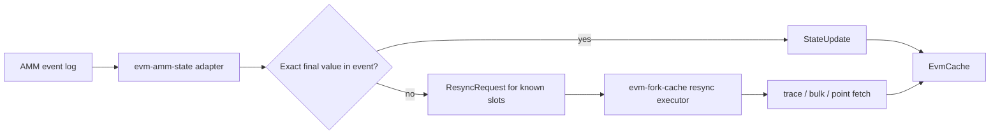
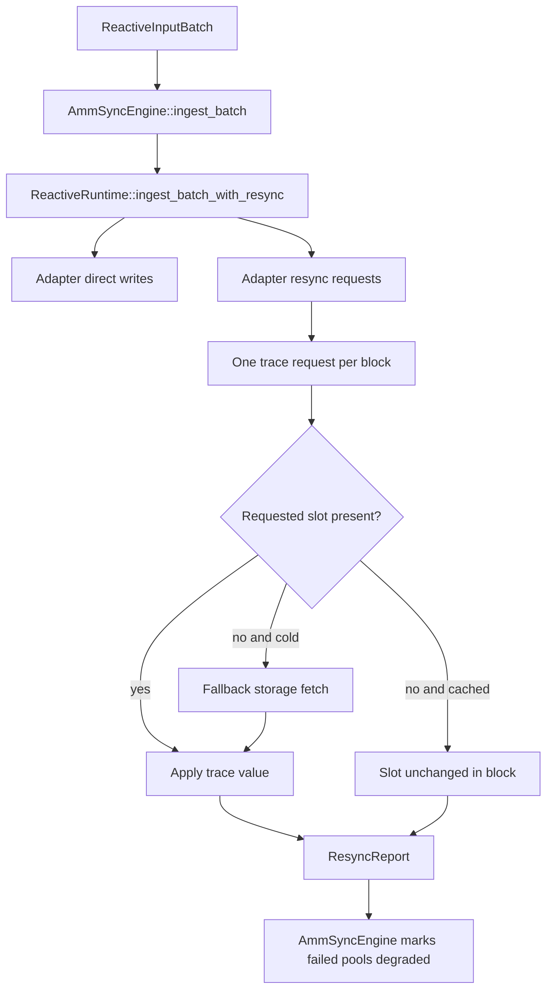
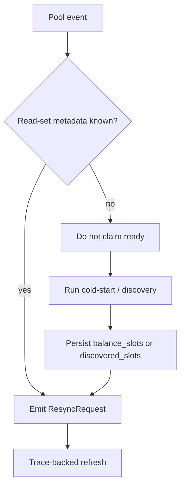

# Trace-backed AMM sync

This note documents how `evm-amm-state` slots into the
`evm-fork-cache` trace-backed resync path.

## Boundary

`evm-fork-cache` owns generic state fetch optimization:

- dedupe requested `(address, slot)` targets,
- group requests by block,
- try `debug_traceBlockByHash` / `debug_traceBlockByNumber`,
- fall back to bulk storage extraction or point reads,
- apply authoritative values to `EvmCache`,
- report unresolved targets.

`evm-amm-state` owns AMM interpretation:

- route logs to pools,
- decode protocol events,
- decide exact write vs slot resync,
- compute protocol slot sets,
- track whether a pool is ready or degraded.

## Runtime Path

Live AMM consumers should use `AmmSyncEngine`. It registers
`AmmReactiveHandler` and always ingests batches through
`ReactiveRuntime::ingest_batch_with_resync`.

Plain `ReactiveRuntime::ingest_batch` is still valid for callers that only want
to collect repair requests. It is not sufficient for live Balancer, Curve, or V3
liquidity sync because it does not execute the resync phase.

## Protocol Policy

| Protocol/event family | Adapter action |
| --- | --- |
| Uniswap V2 `Sync` | exact masked reserve write |
| Solidly V2 `Sync` | exact reserve writes when layout is configured |
| V3 `Swap` | exact slot0/liquidity write |
| V3 `Mint`/`Burn` | exact packed `liquidityGross`/`liquidityNet`, bitmap-bit, and in-range global-liquidity writes for warm (in-window) ticks; resync the computed tick/bitmap/liquidity slots only for cold ticks |
| Balancer V2 `Swap` | exact 112-bit `cash`-field writes when both tokens' probed cash locations are warm; resync known Vault balance slots otherwise |
| Balancer V2 `PoolBalanceChanged` | resync known Vault balance slots |
| Curve swap/liquidity events | resync known pool read-set slots |

The steady-state invariant is: a supported, ready pool either applies a log
exactly or can name the slots that need authoritative refresh. If a pool cannot
name those slots, it should remain `Pending`, `Degraded`, or `Unsupported` until
cold-start or another read-set discovery path establishes metadata.

## Missing Read-sets

`debug_traceBlockByNumber` returns changed slots and final values. It does not
prove a complete quote read-set, because unchanged but quote-critical slots do
not appear in the diff.

So trace data is safe for refreshing known targets. It is only candidate
metadata for discovery. Balancer V2 is especially sensitive because the Vault is
shared by many pools: trace slots under the Vault address must not be blindly
assigned to one pool.

